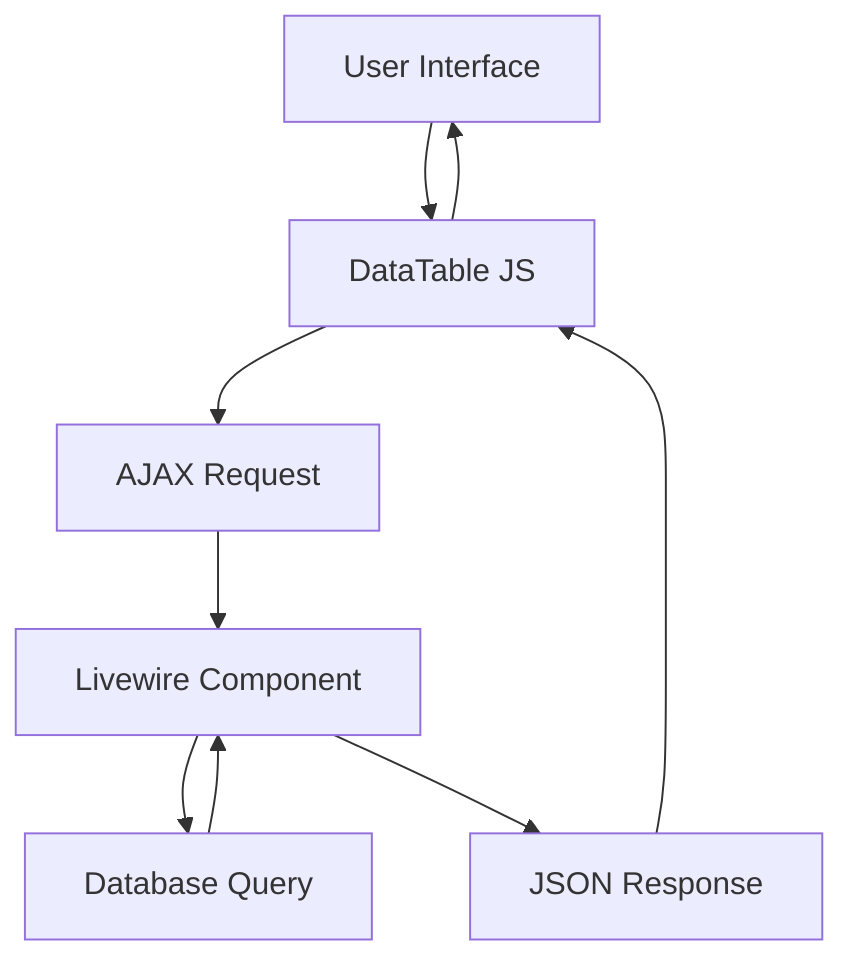

# Planning Implementasi DataTables pada Halaman Kelola Galeri Foto

## Analisa Saat Ini

### File yang dianalisa:
1. **`resources/views/images/index.blade.php`** - View halaman galeri foto
2. **`app/Http/Livewire/ImageIndexComponent.php`** - Komponen Livewire yang mengelola data
3. **`resources/js/app.js`** - File JavaScript utama
4. **`package.json`** - Dependensi npm

### Status DataTables:
- ✅ DataTables sudah terinstall (datatables.net ^2.3.7)
- ✅ DataTables sudah di-import di app.js
- ❌ Belum digunakan pada tabel di view

### Struktur Tabel Saat Ini:
- Menggunakan tabel HTML biasa
- Pagination Laravel (paginate(12))
- Filter: Bulan, Tanggal Mulai, Tanggal Akhir
- Search query (belum ada input di view)
- Kolom: Thumbnail, Nama File, Caption, Upload Date, Ukuran, Aksi

## Arsitektur Solusi

### Pendekatan: Server-side DataTables dengan Livewire

Menggunakan pendekatan server-side karena:
1. Data bisa bertambah banyak
2. Filter kompleks sudah ada di Livewire
3. Lebih efisien untuk data besar
4. Integrasi lebih baik dengan Livewire

### Komponen yang Akan Diubah:



## Rencana Implementasi

### 1. Modifikasi View (`resources/views/images/index.blade.php`)

**Perubahan:**
- Tambah ID pada tabel: `id="imagesTable"`
- Tambah class DataTables: `class="table table-striped w-full"`
- Hapus pagination Laravel
- Hapus loop Blade `@forelse`
- Tambah script inisialisasi DataTables
- Integrasikan dengan Livewire untuk server-side processing

**Struktur DataTables:**
```javascript
$('#imagesTable').DataTable({
    processing: true,
    serverSide: true,
    ajax: {
        url: '/livewire/images-table',
        type: 'GET',
        data: function(d) {
            // Tambah filter dari Livewire
            d.filterMonth = @js($filterMonth);
            d.filterStartDate = @js($filterStartDate);
            d.filterEndDate = @js($filterEndDate);
            d.search = @js($search);
        }
    },
    columns: [
        { data: 'thumbnail', render: ... },
        { data: 'original_filename' },
        { data: 'caption' },
        { data: 'upload_date' },
        { data: 'formatted_size' },
        { data: 'actions', orderable: false }
    ],
    language: {
        url: '//cdn.datatables.net/plug-ins/1.13.6/i18n/id.json'
    },
    responsive: true,
    order: [[3, 'desc']] // Default sort by upload_date desc
});
```

### 2. Modifikasi Livewire Component (`app/Http/Livewire/ImageIndexComponent.php`)

**Perubahan:**
- Tambah method `getImagesData()` untuk DataTables server-side
- Tambah method untuk handle DataTables request
- Integrasi dengan filter yang sudah ada

**Method baru:**
```php
public function getImagesData(Request $request)
{
    // Handle DataTables request
    $draw = $request->get('draw');
    $start = $request->get('start');
    $length = $request->get('length');
    $search = $request->get('search')['value'];
    $order = $request->get('order');
    $columns = $request->get('columns');

    // Build query dengan filter
    $query = Image::query()->with('user');

    // Apply existing filters
    if ($this->filterMonth) {
        $query->byMonth($this->filterMonth);
    }
    // ... other filters

    // Apply DataTables search
    if ($search) {
        $query->where(function($q) use ($search) {
            $q->where('original_filename', 'like', "%{$search}%")
              ->orWhere('caption', 'like', "%{$search}%");
        });
    }

    // Apply DataTables order
    // ...

    // Get total records
    $totalRecords = $query->count();

    // Apply pagination
    $images = $query->offset($start)
                    ->limit($length)
                    ->get();

    // Format data for DataTables
    $data = $images->map(function($image) {
        return [
            'thumbnail' => 'thumbnail_url.'" ...>',
            'original_filename' => $image->original_filename,
            'caption' => $image->caption ?? '-',
            'upload_date' => $image->upload_date->format('d M Y'),
            'formatted_size' => $image->formatted_size,
            'actions' => $this->renderActions($image)
        ];
    });

    return response()->json([
        'draw' => $draw,
        'recordsTotal' => $totalRecords,
        'recordsFiltered' => $totalRecords,
        'data' => $data
    ]);
}
```

### 3. Tambah Route Baru (`routes/web.php`)

**Tambah route untuk DataTables:**
```php
Route::get('/livewire/images-table', [ImageIndexComponent::class, 'getImagesData'])
    ->name('livewire.images-table');
```

### 4. Update Filter Section

**Perubahan:**
- Tambah input search yang terintegrasi dengan DataTables
- Update filter untuk trigger DataTables reload
- Gunakan event Livewire untuk update DataTables

### 5. Styling DataTables

**Tambah CSS kustom:**
- Integrasi dengan Tailwind CSS
- Styling untuk pagination DataTables
- Styling untuk search box DataTables

## Detail Implementasi

### Langkah 1: Update View
- [ ] Tambah ID dan class DataTables pada tabel
- [ ] Hapus loop Blade dan pagination Laravel
- [ ] Tambah script inisialisasi DataTables
- [ ] Tambah event listener untuk filter changes

### Langkah 2: Update Livewire Component
- [ ] Tambah method `getImagesData()`
- [ ] Implementasi server-side processing logic
- [ ] Integrasi dengan filter yang sudah ada
- [ ] Format data untuk DataTables response

### Langkah 3: Tambah Route
- [ ] Tambah route untuk DataTables AJAX endpoint

### Langkah 4: Styling
- [ ] Tambah CSS untuk DataTables
- [ ] Integrasi dengan Tailwind
- [ ] Styling pagination dan search box

### Langkah 5: Testing
- [ ] Test sorting semua kolom
- [ ] Test search
- [ ] Test pagination
- [ ] Test filter (bulan, tanggal)
- [ ] Test aksi (lihat, edit, hapus)
- [ ] Test responsive design

## Pertimbangan Tambahan

### Keuntungan DataTables:
1. ✅ Sorting otomatis untuk semua kolom
2. ✅ Search global dan per kolom
3. ✅ Pagination yang lebih baik
4. ✅ Export data (PDF, Excel, CSV) - bisa ditambahkan nanti
5. ✅ Responsive design
6. ✅ Loading state

### Tantangan:
1. Integrasi dengan Livewire events
2. Menjaga filter Livewire dan DataTables sinkron
3. Aksi tombol (lihat, edit, hapus) harus tetap bekerja dengan Livewire

## Catatan Penting

1. **Cache**: Perlu mempertimbangkan cache strategy untuk DataTables
2. **Performance**: Server-side processing lebih efisien untuk data besar
3. **UX**: Loading state dan empty state harus tetap ada
4. **Localization**: DataTables akan menggunakan bahasa Indonesia
