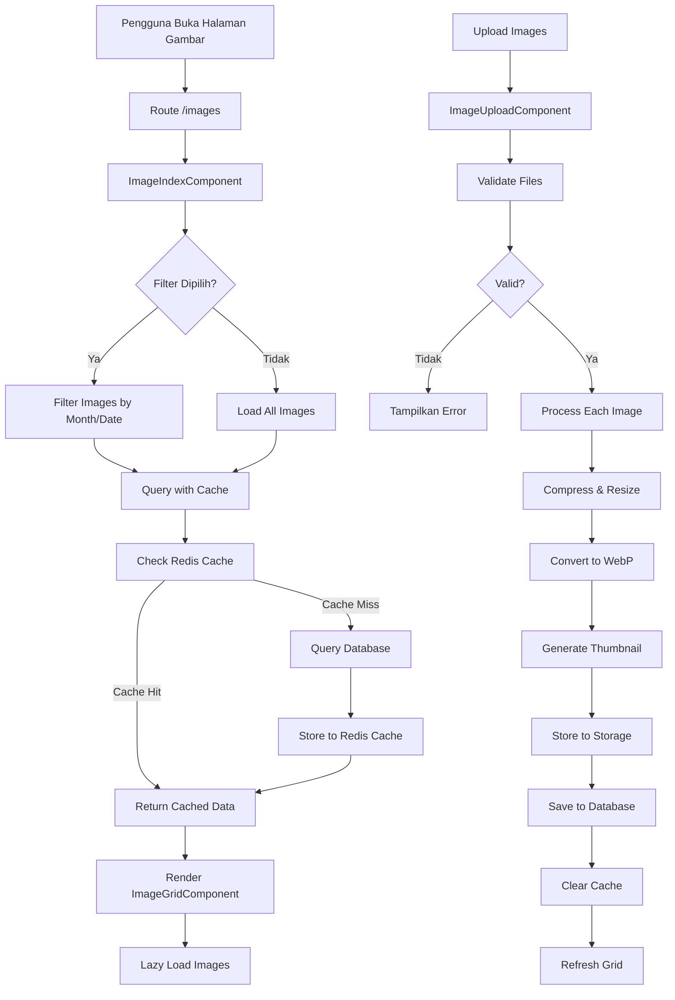
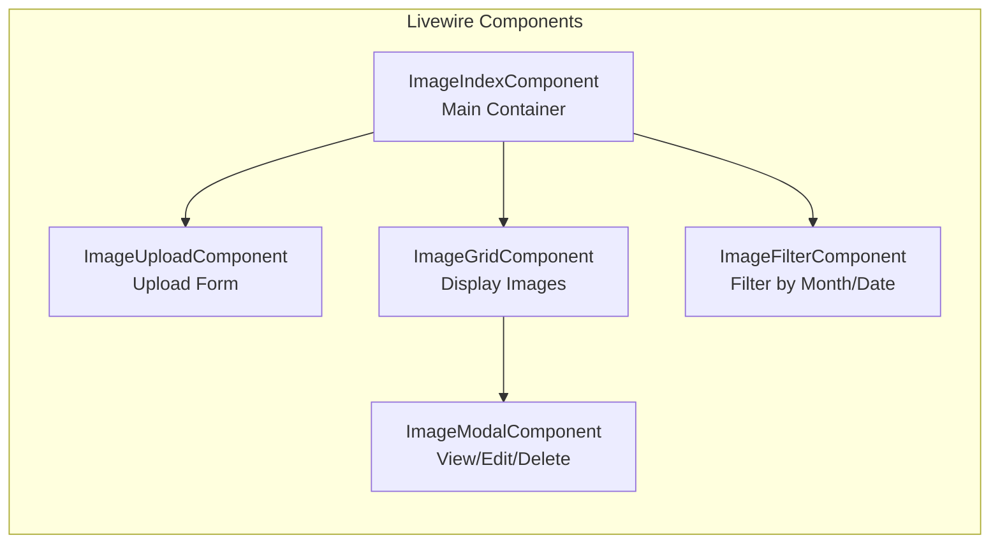

# Rencana Implementasi Halaman CRUD Upload Gambar - Love Documentation

## Ringkasan
Membuat halaman CRUD untuk upload gambar dengan fitur filter berdasarkan bulan dan tanggal, optimasi upload, penyimpanan, loading, caching & delivery. Menggunakan Livewire Component Architecture untuk modularitas dan performa yang baik. Menggunakan UUID sebagai primary key untuk keamanan dan scalability.

## Kebutuhan
- Halaman CRUD gambar dengan bulk upload (upload banyak gambar sekaligus)
- Filter gambar berdasarkan bulan dan tanggal saat upload
- Optimasi upload gambar (compression, resize)
- Optimasi penyimpanan gambar (efficient storage format)
- Optimasi loading di frontend (lazy loading, webp)
- Caching & delivery (Redis cache, CDN-ready)
- Livewire Component Architecture (komponen terpisah)
- Responsive di semua device
- Tema warna coklat soft dengan nuansa cinta

## Arsitektur Sistem





## Langkah-langkah Implementasi

### 1. Database Migration - Tabel Images
**File:** `database/migrations/2026_03_16_create_images_table.php`

Buat migration baru untuk tabel images:
- `uuid` - primary key (CHAR 36, UUID v4)
- `user_id` - foreign key ke users (siapa yang upload)
- `filename` - nama file yang di-hash (SHA-256)
- `original_filename` - nama file asli (untuk display)
- `path` - path file di storage
- `thumbnail_path` - path thumbnail
- `size` - ukuran file dalam bytes
- `mime_type` - tipe mime (image/jpeg, dll)
- `upload_date` - tanggal upload (date)
- `upload_month` - bulan upload (YYYY-MM untuk filter)
- `caption` - keterangan gambar (opsional)
- `created_at`, `updated_at` - timestamps

### 2. Model Image
**File:** `app/Models/Image.php`

Buat model Image:
- Set `$primaryKey` ke `'uuid'`
- Set `$keyType` ke `'string'`
- Set `$incrementing` ke `false`
- Definisikan `$fillable` (termasuk `filename` dan `original_filename`)
- Definisikan relasi `belongsTo User`
- Tambah scope untuk filter by month/date
- Tambah method untuk get URL gambar dan thumbnail
- Tambah method untuk get original filename untuk display
- Tambah trait `HasUuids` atau implementasi UUID generation

### 3. Service Class - Image Processing
**File:** `app/Services/ImageProcessingService.php`

Buat service class untuk:
- Generate hash filename menggunakan SHA-256
- Compress gambar (quality 80%)
- Resize gambar (max width 1920px)
- Convert ke WebP format
- Generate thumbnail (300x300px)
- Optimasi ukuran file
- Return data lengkap (hash filename, path, thumbnail path, size, mime type)

### 4. Livewire Component - ImageIndexComponent
**File:** `app/Http/Livewire/ImageIndexComponent.php`

Komponen utama sebagai container:
- Load data gambar dengan pagination
- Handle filter state
- Emit events ke komponen anak
- Cache management (clear cache saat upload/delete)

### 5. Livewire Component - ImageUploadComponent
**File:** `app/Http/Livewire/ImageUploadComponent.php`

Komponen untuk upload gambar:
- Bulk upload dengan drag & drop
- Preview gambar sebelum upload
- Progress bar untuk setiap gambar
- Validation (max size, allowed types)
- Call ImageProcessingService untuk proses gambar
- Simpan ke database
- Emit event refresh ke parent

### 6. Livewire Component - ImageGridComponent
**File:** `app/Http/Livewire/ImageGridComponent.php`

Komponen untuk menampilkan grid gambar:
- Grid layout responsive
- Lazy loading gambar
- WebP format dengan fallback
- Pagination
- Klik gambar untuk view detail

### 7. Livewire Component - ImageFilterComponent
**File:** `app/Http/Livewire/ImageFilterComponent.php`

Komponen untuk filter:
- Dropdown filter by month
- Date picker untuk filter by date range
- Reset filter button
- Emit event filter-change ke parent

### 8. Livewire Component - ImageModalComponent
**File:** `app/Http/Livewire/ImageModalComponent.php`

Komponen modal untuk view/edit/delete:
- Tampilkan gambar full size
- Form edit caption
- Tombol delete dengan konfirmasi
- Download button

### 9. Views - Blade Templates
**File:** `resources/views/images/index.blade.php`

Layout utama halaman gambar:
- Header dengan judul dan tombol upload
- Filter section
- Grid gambar
- Modal untuk view/edit/delete

**File:** `resources/views/livewire/image-upload-component.blade.php`

Template upload component:
- Drop zone area
- File input multiple
- Preview thumbnails
- Progress indicators

**File:** `resources/views/livewire/image-grid-component.blade.php`

Template grid component:
- Grid layout responsive (1 col mobile, 2 col tablet, 3-4 col desktop)
- Image cards dengan thumbnail
- Lazy loading attribute
- Loading skeleton

**File:** `resources/views/livewire/image-filter-component.blade.php`

Template filter component:
- Month dropdown
- Date range picker
- Reset button

**File:** `resources/views/livewire/image-modal-component.blade.php`

Template modal component:
- Full size image
- Caption form
- Action buttons (edit, delete, download)

### 10. Routes
**File:** `routes/web.php`

Tambahkan route untuk halaman gambar:
```php
Route::middleware('auth')->group(function () {
    Route::get('/images', ImageIndexComponent::class)->name('images.index');
});
```

### 11. Navigation Update
**File:** `resources/views/layouts/navigation.blade.php`

Tambahkan menu "Galeri Foto" di navigation:
- Link ke `/images`
- Ikon galeri
- Active state styling

### 12. Redis Cache Configuration
**File:** `config/cache.php`

Pastikan Redis cache enabled:
- Set default driver ke redis
- Configure prefix untuk image cache

### 13. Storage Configuration
**File:** `config/filesystems.php`

Configure storage untuk gambar:
- Public disk untuk gambar
- Organized folder structure (uploads/YYYY/MM/)
- Symbolic link creation

### 14. Tailwind Styling
Gunakan tema warna yang sudah ada:
- `love-500` untuk primary buttons
- `love-100` untuk backgrounds
- `brown-soft` untuk accents
- Responsive grid dengan `grid-cols-1 md:grid-cols-2 lg:grid-cols-3 xl:grid-cols-4`

### 15. JavaScript untuk Lazy Loading
**File:** `resources/js/lazy-loading.js`

Implementasi lazy loading:
- Intersection Observer API
- Placeholder blur effect
- Progressive loading

## Optimasi yang Akan Diimplementasikan

### 1. Upload Optimasi
- Chunked upload untuk file besar
- Progress tracking per file
- Parallel upload processing
- Client-side validation sebelum upload

### 2. Penyimpanan Optimasi
- WebP format (30-40% lebih kecil dari JPEG)
- Thumbnail generation
- Organized folder structure
- Database indexing untuk fast queries

### 3. Loading Optimasi
- Lazy loading dengan Intersection Observer
- WebP dengan JPEG fallback
- Thumbnail preview sebelum full load
- Skeleton loading state
- Image preloading untuk viewport

### 4. Caching & Delivery
- Redis cache untuk query results
- HTTP caching headers (ETag, Cache-Control)
- CDN-ready structure
- Image versioning untuk cache busting

## Responsive Design Breakdown

### Mobile (Breakpoint < 640px)
- Grid: 1 column
- Modal: full screen
- Filter: stacked vertically
- Upload: drop zone full width

### Tablet (Breakpoint 640px - 1024px)
- Grid: 2 columns
- Modal: centered with max-width
- Filter: horizontal layout
- Upload: drop zone with side preview

### Desktop (Breakpoint > 1024px)
- Grid: 3-4 columns
- Modal: centered with max-width
- Filter: horizontal layout
- Upload: split layout

## File yang Akan Dibuat

### Database
1. `database/migrations/2026_03_16_create_images_table.php`

### Models
2. `app/Models/Image.php`

### Services
3. `app/Services/ImageProcessingService.php`

### Livewire Components
4. `app/Http/Livewire/ImageIndexComponent.php`
5. `app/Http/Livewire/ImageUploadComponent.php`
6. `app/Http/Livewire/ImageGridComponent.php`
7. `app/Http/Livewire/ImageFilterComponent.php`
8. `app/Http/Livewire/ImageModalComponent.php`

### Views
9. `resources/views/images/index.blade.php`
10. `resources/views/livewire/image-upload-component.blade.php`
11. `resources/views/livewire/image-grid-component.blade.php`
12. `resources/views/livewire/image-filter-component.blade.php`
13. `resources/views/livewire/image-modal-component.blade.php`

### JavaScript
14. `resources/js/lazy-loading.js`

### Documentation
15. `plans/image-crud-implementation.md` (file ini)
16. `docs/image-crud-implementation-summary.md` (setelah implementasi)

## File yang Akan Dimodifikasi

1. `routes/web.php` - Tambah route images
2. `resources/views/layouts/navigation.blade.php` - Tambah menu galeri
3. `config/cache.php` - Verify Redis config
4. `config/filesystems.php` - Configure image storage
5. `resources/js/app.js` - Import lazy loading script
6. `tailwind.config.js` - Add any custom utilities if needed

## Dependencies yang Dibutuhkan

### Composer Packages (cek apakah perlu install)
- `intervention/image` - untuk image processing (resize, compress, convert)
- `ramsey/uuid` - sudah include di Laravel 9, untuk UUID generation

### NPM Packages (cek apakah perlu install)
- Tidak ada tambahan, menggunakan native Intersection Observer API

## Order of Execution

1. Install dependency intervention/image
2. Create migration dengan UUID sebagai primary key
3. Run migration
4. Create model Image dengan UUID configuration
5. Create ImageProcessingService
6. Create Livewire Components (mulai dari yang paling sederhana)
7. Create Blade templates
8. Update routes dan navigation
9. Configure storage dan cache
10. Create lazy loading JavaScript
11. Test responsive design
12. Test semua fitur (upload, filter, CRUD)
13. Create documentation summary

## Testing Checklist

- [ ] Bulk upload berhasil
- [ ] Image compression dan resize berfungsi
- [ ] Thumbnail generated dengan benar
- [ ] Filename hash generated dengan benar (SHA-256)
- [ ] Original filename tersimpan dengan benar
- [ ] UUID generated dengan benar
- [ ] UUID unique constraint berfungsi
- [ ] Filter by month berfungsi
- [ ] Filter by date berfungsi
- [ ] Pagination berfungsi
- [ ] Lazy loading berfungsi
- [ ] Modal view/edit/delete berfungsi
- [ ] Cache bekerja (Redis)
- [ ] Responsive di mobile
- [ ] Responsive di tablet
- [ ] Responsive di desktop
- [ ] Error handling untuk invalid files
- [ ] Progress bar berfungsi
- [ ] Cache clear setelah upload/delete
