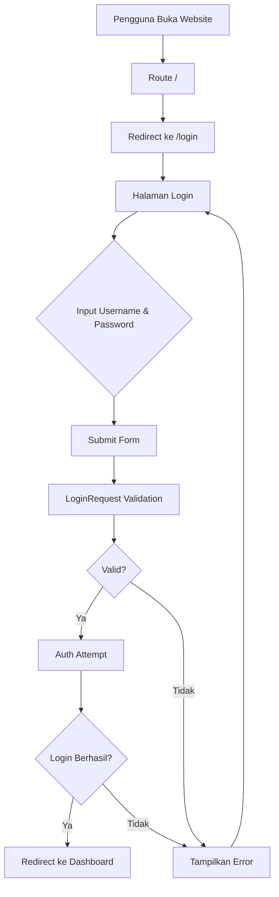

# Rencana Implementasi Halaman Login - Love Documentation

## Ringkasan
Membuat halaman login untuk dokumentasi hubungan dengan pacar, dengan tema warna coklat soft dan nuansa cinta. Login menggunakan username dan password, tanpa fitur registrasi.

## Kebutuhan
- Halaman login dengan field username dan password
- Tidak ada halaman register
- Redirect ke login saat membuka project
- Seeder untuk 2 user:
  - username: `abel`, password: `abel`
  - username: `akhsa`, password: `akhsa`
- Tema warna coklat soft dengan nuansa cinta
- Menggunakan Tailwind CSS dan Livewire

## Arsitektur Sistem



## Langkah-langkah Implementasi

### 1. Database Migration - Tambah Kolom Username
**File:** `database/migrations/xxxx_xx_xx_add_username_to_users_table.php`

Buat migration baru untuk menambahkan kolom `username` ke tabel users:
- Tambah kolom `username` dengan tipe string
- Buat kolom `username` unique
- Kolom `email` tetap ada tapi tidak digunakan untuk login

### 2. Update Model User
**File:** `app/Models/User.php`

Modifikasi model User:
- Tambah `username` ke `$fillable`
- Override method `findForPassport` atau buat method custom untuk auth dengan username
- Update auth configuration untuk menggunakan username

### 3. Update LoginRequest
**File:** `app/Http/Requests/Auth/LoginRequest.php`

Ubah validasi:
- Ganti `email` dengan `username`
- Ubah rule validasi dari email ke string
- Update method `authenticate()` untuk menggunakan username

### 4. Update AuthenticatedSessionController
**File:** `app/Http/Controllers/Auth/AuthenticatedSessionController.php`

Sesuaikan controller:
- Pastikan redirect setelah login ke dashboard
- Tidak perlu perubahan besar karena logic ada di LoginRequest

### 5. Hapus Route Register
**File:** `routes/auth.php`

Hapus route register:
- Hapus `Route::get('register', ...)`
- Hapus `Route::post('register', ...)`
- Hapus import `RegisteredUserController`

### 6. Ubah Route Root
**File:** `routes/web.php`

Ubah route root:
- Ganti `Route::get('/', function () { return view('welcome'); })`
- Menjadi `Route::redirect('/', '/login')`

### 7. Buat UserSeeder
**File:** `database/seeders/UserSeeder.php`

Buat seeder baru:
- Buat user dengan username `abel` dan password `abel`
- Buat user dengan username `akhsa` dan password `akhsa`
- Password harus di-hash menggunakan `Hash::make()`

### 8. Update Tailwind Config
**File:** `tailwind.config.js`

Tambahkan warna coklat soft tema cinta:
```javascript
colors: {
    love: {
        50: '#FDF5F2',
        100: '#FCE8E0',
        200: '#F8D0C2',
        300: '#F2B09A',
        400: '#EA8669',
        500: '#D96B4F',
        600: '#C4553D',
        700: '#A64636',
        800: '#8B3D31',
        900: '#75352D',
        950: '#4E1F1A',
    },
    brown: {
        soft: '#D4A574',
        light: '#E8C9A0',
        medium: '#C4956A',
        dark: '#8B6F47',
    }
}
```

### 9. Redesign Halaman Login
**File:** `resources/views/auth/login.blade.php`

Desain halaman login dengan:
- Background gradient coklat soft dengan nuansa cinta
- Card login dengan shadow dan rounded corners
- Ikon hati atau elemen dekoratif cinta
- Animasi hover yang smooth
- Form dengan field username dan password
- Tombol login dengan warna tema cinta
- Hapus link "Forgot password" dan "Register"

### 10. Update DatabaseSeeder
**File:** `database/seeders/DatabaseSeeder.php`

Tambahkan UserSeeder:
- Uncomment atau tambahkan `$this->call(UserSeeder::class);`

### 11. Jalankan Migration dan Seeder

Perintah yang perlu dijalankan:
```bash
php artisan migrate
php artisan db:seed
```

## Struktur File yang Akan Dibuat/Dimodifikasi

```
├── database/
│   ├── migrations/
│   │   └── xxxx_xx_xx_add_username_to_users_table.php (BUAT BARU)
│   └── seeders/
│       ├── UserSeeder.php (BUAT BARU)
│       └── DatabaseSeeder.php (MODIFIKASI)
├── app/
│   ├── Models/
│   │   └── User.php (MODIFIKASI)
│   ├── Http/
│   │   ├── Controllers/
│   │   │   └── Auth/
│   │   │       └── AuthenticatedSessionController.php (MODIFIKASI)
│   │   └── Requests/
│   │       └── Auth/
│   │           └── LoginRequest.php (MODIFIKASI)
├── routes/
│   ├── web.php (MODIFIKASI)
│   └── auth.php (MODIFIKASI)
├── resources/
│   └── views/
│       └── auth/
│           └── login.blade.php (MODIFIKASI)
└── tailwind.config.js (MODIFIKASI)
```

## Detail Desain Halaman Login

### Layout
- Full screen dengan background gradient
- Card login di tengah layar
- Responsive untuk mobile dan desktop

### Warna
- Background: Gradient dari love-100 ke love-200
- Card: White dengan shadow-xl
- Input border: love-300, focus: love-500
- Button: love-600 dengan hover love-700
- Text: love-900 untuk primary, love-700 untuk secondary

### Elemen Dekoratif
- Ikon hati di atas form
- Subtitle romantis
- Animasi pulse pada ikon hati
- Smooth transitions pada input dan button

## Catatan Penting

1. **Password Hashing**: Pastikan password di-hash menggunakan `Hash::make()` di seeder
2. **Auth Configuration**: Laravel default menggunakan email, perlu konfigurasi custom untuk username
3. **Livewire**: Meskipun disebutkan, untuk login sederhana form HTML biasa sudah cukup
4. **Security**: Pastikan CSRF token ada di form
5. **Redirect After Login**: Default redirect ke dashboard, bisa disesuaikan

## Testing Setelah Implementasi

1. Buka website, harus redirect ke `/login`
2. Coba login dengan username `abel` dan password `abel`
3. Coba login dengan username `akhsa` dan password `akhsa`
4. Coba login dengan kredensial salah, harus muncul error
5. Coba akses `/register`, harus 404
6. Logout harus redirect kembali ke login
