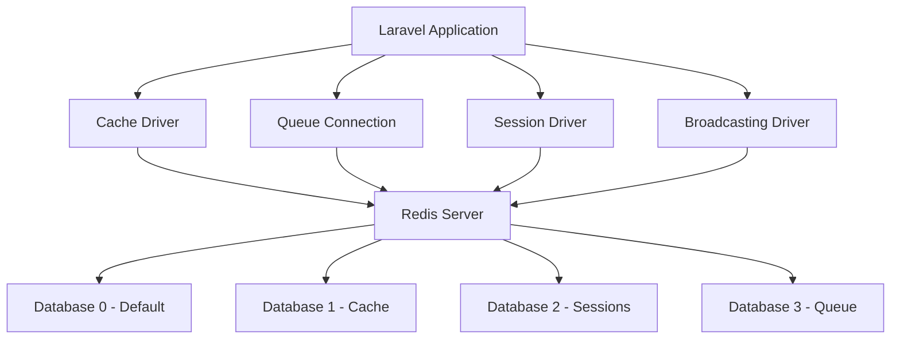

# Planning Setup Redis untuk Laravel Project

## Ringkasan Project
- **Framework**: Laravel 9.x
- **Frontend**: Livewire 2.12
- **Database**: PostgreSQL (love_db)
- **Sistem Operasi**: Linux 6.17
- **Tujuan**: Setup Redis native untuk meningkatkan performa aplikasi

## Arsitektur Redis Integration



## Langkah-langkah Implementasi

### 1. Install Redis di Sistem (Linux)

#### 1.1 Update package manager dan install Redis
```bash
sudo apt update
sudo apt install redis-server -y
```

#### 1.2 Enable Redis service
```bash
sudo systemctl enable redis-server
sudo systemctl start redis-server
```

#### 1.3 Verifikasi Redis berjalan
```bash
sudo systemctl status redis-server
redis-cli ping
# Expected output: PONG
```

#### 1.4 Konfigurasi Redis (opsional - untuk production)
File: `/etc/redis/redis.conf`
- Set password untuk keamanan
- Set maxmemory untuk membatasi penggunaan RAM
- Set persistence mode (RDB/AOF)

### 2. Install PHP Redis Extension

#### 2.1 Install php-redis
```bash
sudo apt install php8.x-redis -y
# Ganti 8.x dengan versi PHP yang terinstall
```

#### 2.2 Verifikasi extension terinstall
```bash
php -m | grep redis
# Expected output: redis
```

#### 2.3 Restart PHP-FPM (jika menggunakan PHP-FPM)
```bash
sudo systemctl restart php8.x-fpm
# Ganti 8.x dengan versi PHP yang terinstall
```

### 3. Update Konfigurasi .env

File: `.env`

#### 3.1 Update Redis configuration
```env
REDIS_HOST=127.0.0.1
REDIS_PASSWORD=null
REDIS_PORT=6379
REDIS_CLIENT=phpredis
REDIS_DB=0
REDIS_CACHE_DB=1
```

#### 3.2 Update Cache driver
```env
CACHE_DRIVER=redis
```

#### 3.3 Update Queue connection
```env
QUEUE_CONNECTION=redis
```

#### 3.4 Update Session driver
```env
SESSION_DRIVER=redis
SESSION_CONNECTION=default
```

#### 3.5 Update Broadcasting driver
```env
BROADCAST_DRIVER=redis
```

### 4. Verifikasi Konfigurasi Redis di Laravel

#### 4.1 Cek konfigurasi database.php
File: `config/database.php`
- Pastikan konfigurasi redis sudah benar
- Default connection dan cache connection sudah terkonfigurasi

#### 4.2 Cek konfigurasi cache.php
File: `config/cache.php`
- Pastikan redis store sudah terkonfigurasi dengan connection 'cache'

#### 4.3 Cek konfigurasi queue.php
File: `config/queue.php`
- Pastikan redis connection sudah terkonfigurasi dengan connection 'default'

#### 4.4 Cek konfigurasi session.php
File: `config/session.php`
- Pastikan driver sudah diset ke redis
- Pastikan connection sudah diset (optional, akan menggunakan default redis connection)

#### 4.5 Cek konfigurasi broadcasting.php
File: `config/broadcasting.php`
- Pastikan redis connection sudah terkonfigurasi

### 5. Test Koneksi Redis

#### 5.1 Test dengan Artisan Tinker
```bash
php artisan tinker
```

```php
// Test basic connection
Redis::ping();
// Expected output: true

// Test set and get
Redis::set('test_key', 'test_value');
Redis::get('test_key');
// Expected output: 'test_value'

// Test delete
Redis::del('test_key');
```

#### 5.2 Test Cache
```php
Cache::put('test_cache', 'test_value', 60);
Cache::get('test_cache');
// Expected output: 'test_value'
```

#### 5.3 Test Session
```php
session(['test_session' => 'test_value']);
session('test_session');
// Expected output: 'test_value'
```

### 6. Setup Redis untuk Cache

#### 6.1 Cache configuration sudah terkonfigurasi di step 3

#### 6.2 Test cache operations
```bash
php artisan tinker
```

```php
// Test basic cache
Cache::remember('users.count', 60, function() {
    return User::count();
});

// Test cache tags (opsional)
Cache::tags(['users'])->put('user.1', $user, 3600);
```

#### 6.3 Clear cache
```bash
php artisan cache:clear
```

### 7. Setup Redis untuk Queue

#### 7.1 Queue configuration sudah terkonfigurasi di step 3

#### 7.2 Create test job
```bash
php artisan make:job TestJob
```

#### 7.3 Implement test job
File: `app/Jobs/TestJob.php`

```php
<?php

namespace App\Jobs;

use Illuminate\Bus\Queueable;
use Illuminate\Contracts\Queue\ShouldQueue;
use Illuminate\Foundation\Bus\Dispatchable;
use Illuminate\Queue\InteractsWithQueue;
use Illuminate\Queue\SerializesModels;
use Illuminate\Support\Facades\Log;

class TestJob implements ShouldQueue
{
    use Dispatchable, InteractsWithQueue, Queueable, SerializesModels;

    public function __construct()
    {
        //
    }

    public function handle()
    {
        Log::info('TestJob executed successfully!');
    }
}
```

#### 7.4 Test queue
```bash
php artisan tinker
```

```php
App\Jobs\TestJob::dispatch();
```

#### 7.5 Run queue worker
```bash
php artisan queue:work redis
```

#### 7.6 Monitor queue
```bash
php artisan queue:monitor
```

### 8. Setup Redis untuk Session

#### 8.1 Session configuration sudah terkonfigurasi di step 3

#### 8.2 Test session
```bash
php artisan tinker
```

```php
session(['test_key' => 'test_value']);
session('test_key');
// Expected output: 'test_value'
```

#### 8.3 Verify session stored in Redis
```bash
redis-cli
```

```
KEYS laravel_database_*
```

### 9. Setup Redis untuk Broadcasting

#### 9.1 Broadcasting configuration sudah terkonfigurasi di step 3

#### 9.2 Install Laravel Echo Server (opsional, untuk WebSocket)
```bash
npm install -g laravel-echo-server
```

#### 9.3 Initialize Laravel Echo Server
```bash
laravel-echo-server init
```

#### 9.4 Start Laravel Echo Server
```bash
laravel-echo-server start
```

#### 9.5 Test broadcasting
```bash
php artisan tinker
```

```php
use Illuminate\Support\Facades\Broadcast;

Broadcast::channel('test-channel', function () {
    return true;
});

event(new \App\Events\TestEvent());
```

### 10. Konfigurasi Queue Worker

#### 10.1 Setup Supervisor untuk Queue Worker (Production)

Install supervisor:
```bash
sudo apt install supervisor -y
```

Create supervisor config:
File: `/etc/supervisor/conf.d/laravel-worker.conf`

```ini
[program:laravel-worker]
process_name=%(program_name)s_%(process_num)02d
command=php /home/abel-natanael/dev/personal/love-documentation/artisan queue:work redis --sleep=3 --tries=3 --max-time=3600
autostart=true
autorestart=true
stopasgroup=true
killasgroup=true
user=abel-natanael
numprocs=2
redirect_stderr=true
stdout_logfile=/home/abel-natanael/dev/personal/love-documentation/storage/logs/worker.log
stopwaitsecs=3600
```

Start supervisor:
```bash
sudo supervisorctl reread
sudo supervisorctl update
sudo supervisorctl start laravel-worker:*
```

#### 10.2 Monitor queue worker
```bash
sudo supervisorctl status
```

### 11. Test Semua Konfigurasi Redis

#### 11.1 Test comprehensive flow
```bash
php artisan tinker
```

```php
// Test Cache
Cache::put('test', 'value', 60);
Cache::get('test');

// Test Queue
App\Jobs\TestJob::dispatch();

// Test Session
session(['key' => 'value']);
session('key');

// Test Broadcasting
event(new \App\Events\TestEvent());

// Test Redis directly
Redis::set('direct_test', 'value');
Redis::get('direct_test');
```

#### 11.2 Verify Redis data
```bash
redis-cli
```

```
KEYS *
DBSIZE
INFO
```

#### 11.3 Test with Livewire component
Create a Livewire component that uses cache:
```php
class CachedComponent extends Component
{
    public $data;

    public function mount()
    {
        $this->data = Cache::remember('cached_data', 3600, function() {
            return DB::table('users')->get();
        });
    }

    public function render()
    {
        return view('livewire.cached-component');
    }
}
```

### 12. Optimasi Redis untuk Production

#### 12.1 Konfigurasi Redis untuk production
File: `/etc/redis/redis.conf`

```conf
# Set password
requirepass your_strong_password_here

# Set max memory (sesuaikan dengan RAM server)
maxmemory 256mb

# Set eviction policy
maxmemory-policy allkeys-lru

# Enable persistence (opsional)
save 900 1
save 300 10
save 60 10000
```

#### 12.2 Update .env untuk production
```env
REDIS_PASSWORD=your_strong_password_here
```

#### 12.3 Restart Redis
```bash
sudo systemctl restart redis-server
```

### 13. Troubleshooting Common Issues

#### 13.1 Redis connection refused
- Pastikan Redis server berjalan: `sudo systemctl status redis-server`
- Cek port: `sudo netstat -tlnp | grep 6379`
- Cek firewall: `sudo ufw status`

#### 13.2 PHP Redis extension not found
- Verifikasi installation: `php -m | grep redis`
- Restart PHP-FPM: `sudo systemctl restart php8.x-fpm`

#### 13.3 Queue jobs not processing
- Check queue worker status: `sudo supervisorctl status`
- Check logs: `tail -f storage/logs/worker.log`
- Check Redis queue: `redis-cli` -> `LLEN queues:default`

#### 13.4 Session not persisting
- Verify session driver: `echo config('session.driver')`
- Check Redis for session keys: `redis-cli` -> `KEYS laravel_database_*`

### 14. Monitoring dan Maintenance

#### 14.1 Monitor Redis performance
```bash
redis-cli INFO
redis-cli INFO memory
redis-cli INFO stats
```

#### 14.2 Monitor Laravel cache
```bash
php artisan cache:clear
php artisan config:clear
php artisan route:clear
php artisan view:clear
```

#### 14.3 Backup Redis data (opsional)
```bash
# Manual backup
redis-cli SAVE

# Copy dump file
sudo cp /var/lib/redis/dump.rdb /backup/redis-backup-$(date +%Y%m%d).rdb
```

### 15. File yang Akan Dimodifikasi

| File | Deskripsi |
|------|-----------|
| `.env` | Update Redis configuration dan driver settings |
| `config/database.php` | Verifikasi Redis connection configuration |
| `config/cache.php` | Verifikasi Redis cache store |
| `config/queue.php` | Verifikasi Redis queue connection |
| `config/session.php` | Verifikasi Redis session driver |
| `config/broadcasting.php` | Verifikasi Redis broadcasting connection |
| `/etc/redis/redis.conf` | Redis server configuration (opsional) |
| `/etc/supervisor/conf.d/laravel-worker.conf` | Queue worker configuration (production) |

### 16. Checklist Final

- [ ] Redis server terinstall dan berjalan
- [ ] PHP Redis extension terinstall
- [ ] Konfigurasi .env diupdate untuk Redis
- [ ] Cache driver diubah ke Redis
- [ ] Queue connection diubah ke Redis
- [ ] Session driver diubah ke Redis
- [ ] Broadcasting driver diubah ke Redis
- [ ] Koneksi Redis berhasil ditest
- [ ] Cache operations berfungsi
- [ ] Queue jobs dapat diproses
- [ ] Session tersimpan di Redis
- [ ] Broadcasting berfungsi
- [ ] Queue worker dikonfigurasi (jika production)
- [ ] Semua fitur Redis berhasil ditest
- [ ] Dokumentasi selesai

## Catatan Penting

1. **Security**: Selalu set password untuk Redis di production environment
2. **Memory**: Sesuaikan `maxmemory` dengan kapasitas RAM server
3. **Persistence**: Pertimbangkan untuk enable persistence (RDB/AOF) untuk production
4. **Monitoring**: Setup monitoring untuk Redis dan queue workers
5. **Backup**: Backup Redis data secara berkala jika menggunakan persistence
6. **Queue Workers**: Gunakan Supervisor untuk memastikan queue workers selalu berjalan
7. **Testing**: Test semua fitur Redis sebelum deploy ke production

## Referensi

- [Laravel Redis Documentation](https://laravel.com/docs/9.x/redis)
- [Redis Documentation](https://redis.io/documentation)
- [Laravel Queues Documentation](https://laravel.com/docs/9.x/queues)
- [Laravel Broadcasting Documentation](https://laravel.com/docs/9.x/broadcasting)
