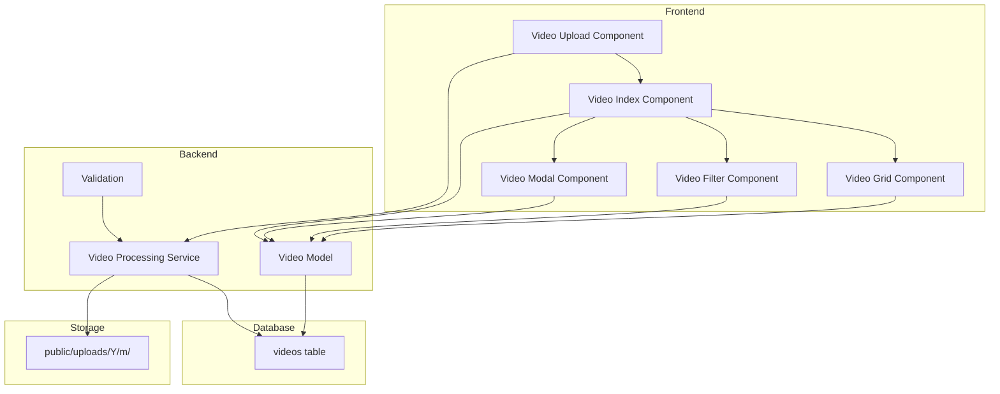

# Rencana Implementasi CRUD Video

## Ringkasan Analisis Mekanisme Upload Gambar

Berdasarkan analisis terhadap fitur upload gambar yang ada, berikut adalah arsitektur yang digunakan:

### 1. Database Schema
- Tabel `images` dengan UUID sebagai primary key
- Kolom: uuid, user_id, filename, original_filename, path, thumbnail_path, size, mime_type, upload_date, upload_month, caption, timestamps
- Index untuk optimasi query

### 2. Model Layer
- `Image` model dengan:
  - UUID primary key
  - Relationship dengan User
  - Scopes untuk filtering (byMonth, byDateRange)
  - Accessors (url, thumbnail_url, display_name, formatted_size)

### 3. Service Layer
- `ImageProcessingService`:
  - Generate UUID
  - Convert ke WebP dengan kompresi
  - Resize gambar utama (max 1920px)
  - Buat thumbnail (300x300 square)
  - Simpan ke storage dengan struktur folder `uploads/Y/m/`
  - Validasi file (mime type)
  - Delete file dari storage

### 4. Livewire Components
- `ImageUploadComponent`: Upload multiple dengan drag & drop, preview, caption, progress
- `ImageIndexComponent`: List dengan filtering, pagination, search
- `ImageModalComponent`: Detail, edit caption, delete, download
- `ImageFilterComponent`: Filter by month/date range
- `ImageGridComponent`: Display in grid layout

### 5. Views
- Upload form dengan drag & drop
- Modal untuk detail/edit/delete
- Main page dengan table dan filter

### 6. Validation
- File type: image/jpeg, image/jpg, image/png, image/gif, image/webp
- Max size: 50MB
- Multiple files allowed

---

## Rencana Implementasi CRUD Video

### Langkah 1: Database Migration

Buat migration untuk tabel `videos` dengan struktur yang sama persis dengan `images`:

```php
Schema::create('videos', function (Blueprint $table) {
    $table->uuid('uuid')->primary();
    $table->foreignId('user_id')->constrained()->onDelete('cascade');
    $table->string('filename')->unique();
    $table->string('original_filename');
    $table->string('path');
    $table->string('thumbnail_path'); // Untuk thumbnail video
    $table->integer('size');
    $table->string('mime_type');
    $table->date('upload_date');
    $table->string('upload_month')->index();
    $table->text('caption')->nullable();
    $table->timestamps();
    
    // Indexes untuk optimasi query
    $table->index(['user_id', 'upload_month']);
    $table->index('upload_date');
});
```

### Langkah 2: Model Video

Buat `Video` model dengan struktur yang sama persis dengan `Image` model:

- UUID primary key
- Relationship dengan User
- Scopes untuk filtering (byMonth, byDateRange)
- Accessors (url, thumbnail_url, display_name, formatted_size)

### Langkah 3: Video Processing Service

Buat `VideoProcessingService` dengan mekanisme yang sama dengan `ImageProcessingService`:

**Fitur utama untuk video:**
- Validasi video file types (mp4, webm, mov, avi)
- Generate thumbnail dari video (menggunakan FFmpeg)
- **Compress video** (menggunakan FFmpeg):
  - Convert ke format yang lebih efisien (H.264/H.265)
  - Optimasi bitrate dan quality
  - Resize jika resolusi terlalu besar (max 1920x1080)
- Simpan ke storage dengan struktur folder yang sama: `uploads/Y/m/`

**Fitur yang sama dengan gambar:**
- Generate UUID
- Get file info
- Delete file dari storage
- Validasi file

**Konfigurasi Compression:**
- Max resolution: 1920x1080 (Full HD)
- Video codec: H.264 (libx264) atau H.265 (libx265)
- Audio codec: AAC
- Quality preset: medium (balance antara size dan quality)
- CRF (Constant Rate Factor): 23-28 (semakin rendah semakin bagus, tapi file lebih besar)

### Langkah 4: Livewire Components

Buat komponen Livewire untuk video dengan struktur yang sama persis:

1. **VideoUploadComponent**
   - Upload multiple videos dengan drag & drop
   - Preview video
   - Caption input
   - Progress tracking
   - Remove video from queue

2. **VideoIndexComponent**
   - List videos dengan filtering
   - Pagination
   - Search
   - Event listeners untuk refresh

3. **VideoModalComponent**
   - Detail video
   - Edit caption
   - Delete video
   - Download video
   - Play video preview

4. **VideoFilterComponent**
   - Filter by month
   - Filter by date range
   - Reset filters

5. **VideoGridComponent**
   - Display videos in grid layout
   - Thumbnail preview

### Langkah 5: Views

Buat views untuk video dengan struktur yang sama:

1. `video-upload-component.blade.php`
   - Drop zone untuk drag & drop
   - Video preview
   - Caption input
   - Progress bar

2. `video-modal-component.blade.php`
   - Video player
   - Video info (filename, size, date, uploader)
   - Caption section (view/edit)
   - Action buttons (edit, delete, download)

3. `videos/index.blade.php`
   - Filter section
   - Video table/grid
   - Upload button
   - Pagination

### Langkah 6: Routes

Tambahkan route untuk video:

```php
Route::get('/videos', VideoIndexComponent::class)->name('videos.index');
```

### Langkah 7: Validation

Set validation rules untuk video:

- File type: video/mp4, video/webm, video/quicktime, video/x-msvideo
- Max size: **1GB** (1024MB)
- Multiple files allowed

### Langkah 8: Sidebar Menu

Tambahkan menu item untuk video di sidebar:

- Link ke `/videos`
- Icon video
- Label "Video Gallery"

---

## Diagram Arsitektur



---

## File yang Perlu Dibuat

### Backend
1. `database/migrations/XXXX_XX_XX_XXXXXX_create_videos_table.php`
2. `app/Models/Video.php`
3. `app/Services/VideoProcessingService.php`
4. `app/Http/Livewire/VideoUploadComponent.php`
5. `app/Http/Livewire/VideoIndexComponent.php`
6. `app/Http/Livewire/VideoModalComponent.php`
7. `app/Http/Livewire/VideoFilterComponent.php`
8. `app/Http/Livewire/VideoGridComponent.php`

### Frontend
1. `resources/views/livewire/video-upload-component.blade.php`
2. `resources/views/livewire/video-modal-component.blade.php`
3. `resources/views/videos/index.blade.php`
4. `resources/views/livewire/video-grid-component.blade.php`

### Routes
1. Update `routes/web.php`

### Sidebar
1. Update sidebar component untuk menambahkan menu video

---

## Catatan Penting

### Perbedaan Utama Gambar vs Video

| Aspek | Gambar | Video |
|-------|-------|-------|
| Processing | Resize, compress, convert ke WebP | Compress (H.264/H.265), resize, generate thumbnail |
| Storage | Compressed WebP | Compressed MP4 (H.264) |
| Preview | Image tag | Video player |
| Max Size | 50MB | 1GB (1024MB) |
| File Types | jpeg, jpg, png, gif, webp | mp4, webm, mov, avi |
| Compression | WebP format, quality 80% | H.264 codec, CRF 23-28 |
| Max Resolution | 1920px width | 1920x1080 (Full HD) |

### Dependensi Tambahan

Untuk video processing, **WAJIB** install FFmpeg:
```bash
# Ubuntu/Debian
sudo apt-get install ffmpeg

# macOS
brew install ffmpeg

# Windows
# Download dari https://ffmpeg.org/download.html
```

PHP FFmpeg package (wajib untuk video compression):
```bash
composer require php-ffmpeg/php-ffmpeg
```

**Konfigurasi FFmpeg di Laravel:**
Tambahkan ke `config/app.php` atau buat config file baru:
```php
'ffmpeg' => [
    'ffmpeg.binaries' => '/usr/bin/ffmpeg',
    'ffprobe.binaries' => '/usr/bin/ffprobe',
    'timeout' => 3600, // 1 hour timeout untuk video besar
    'threads' => 12, // Jumlah thread untuk processing
],
```

---

## Alur Kerja Implementasi

1. Install FFmpeg dan php-ffmpeg package
2. Konfigurasi FFmpeg di Laravel
3. Buat migration dan jalankan
4. Buat Video model
5. Buat VideoProcessingService dengan FFmpeg integration (compression + thumbnail)
6. Buat Livewire components (mulai dari VideoUploadComponent)
7. Buat views untuk setiap component
8. Tambahkan routes
9. Update sidebar menu
10. Test upload, view, edit, delete video (dengan file besar untuk test compression)

---

## Detail Video Compression

### Proses Compression:

1. **Input Video**: Video original (mp4, webm, mov, avi) hingga 1GB
2. **FFmpeg Processing**:
   - Convert ke H.264 codec (lebih efisien)
   - Resize jika resolusi > 1920x1080
   - Set CRF 23-28 (balance quality/size)
   - Compress audio ke AAC
3. **Output Video**: MP4 terkompresi dengan thumbnail

### Perintah FFmpeg yang akan digunakan:

```bash
# Compress video
ffmpeg -i input.mp4 -c:v libx264 -crf 26 -preset medium -vf "scale=1920:1080:force_original_aspect_ratio=decrease" -c:a aac -b:a 128k output.mp4

# Generate thumbnail
ffmpeg -i input.mp4 -ss 00:00:01 -vframes 1 -vf scale=300:-1 thumbnail.jpg
```

### Konfigurasi Quality:

| CRF Value | Kualitas | Ukuran File | Use Case |
|-----------|----------|-------------|----------|
| 18-23 | Sangat Bagus | Besar | High quality content |
| 23-28 | Bagus | Sedang | General use (default) |
| 28-32 | Cukup | Kecil | Storage optimization |

**Default yang akan digunakan: CRF 26 (balance bagus)**
